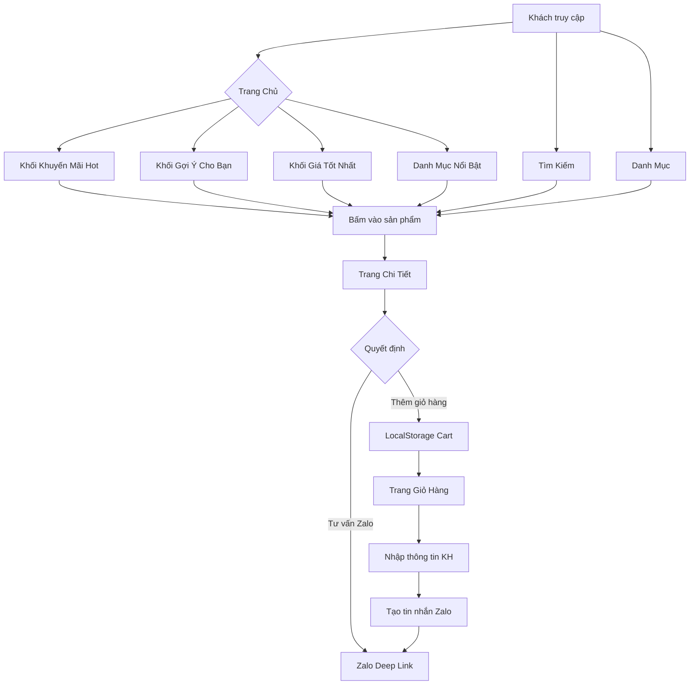

# 🛒 TANDA — Website Phân Phối Camera & Thiết Bị An Ninh


**TANDA** là website thương mại điện tử chuyên phân phối camera giám sát, đầu ghi hình, thiết bị mạng và phụ kiện an ninh. Hệ thống được xây dựng bằng **PHP thuần (Vanilla PHP) + MySQL**, sử dụng giao diện theo phong cách **Thế Giới Di Động (TGDĐ)** — tối ưu cho người dùng Việt Nam.

---

## 📋 Mục Lục

- [Tính Năng Chính](#-tính-năng-chính)
- [Công Nghệ Sử Dụng](#-công-nghệ-sử-dụng)
- [Cấu Trúc Dự Án](#-cấu-trúc-dự-án)
- [Yêu Cầu Hệ Thống](#-yêu-cầu-hệ-thống)
- [Cài Đặt](#-cài-đặt)
- [Cơ Sở Dữ Liệu](#-cơ-sở-dữ-liệu)
- [Luồng Hoạt Động](#-luồng-hoạt-động)
- [Hướng Dẫn Sử Dụng](#-hướng-dẫn-sử-dụng)
- [Tùy Chỉnh](#-tùy-chỉnh)

---

## ✨ Tính Năng Chính

### 🛍️ Frontend (Khách hàng)

| Tính Năng | Mô Tả |
|-----------|-------|
| **Trang Chủ** | 4 khối sản phẩm: Khuyến mãi Hot, Gợi ý cho bạn, Giá tốt nhất, Danh mục nổi bật |
| **Danh Mục Sản Phẩm** | Lọc theo danh mục (Camera WiFi, Trọn Bộ, Đầu Ghi, Phụ Kiện, Thiết Bị Mạng) |
| **Tìm Kiếm** | Tìm kiếm theo tên, SKU, thông số — hỗ trợ tách từ khóa AND |
| **Chi Tiết Sản Phẩm** | Ảnh gallery, giá sale, thông số kỹ thuật, nút Zalo tư vấn |
| **Giỏ Hàng** | Lưu vào LocalStorage, chỉnh sửa số lượng, xóa sản phẩm |
| **Đặt Hàng Qua Zalo** | Tự động tạo tin nhắn Zalo với danh sách đơn hàng, copy & mở Zalo |
| **Bộ Lọc Nhanh** | Filter pill trên trang chủ, sắp xếp theo giá/mới nhất trên danh mục |
| **Chính Sách** | Hướng dẫn mua hàng, Bảo hành, Đổi trả, Thanh toán, Vận chuyển |
| **Từ Khóa Phổ Biến** | Footer hiển thị từ khóa tìm kiếm nhiều nhất |

### ⚙️ Backend (Quản trị)

| Tính Năng | Mô Tả |
|-----------|-------|
| **Import CSV** | Upload file CSV hàng loạt sản phẩm, tự động map ảnh theo SKU |
| **Tối Ưu Ảnh** | Tự động resize & nén ảnh upload (GD Library), hỗ trợ JPG/PNG/GIF/WebP |
| **IndexedDB** | Lưu tạm dữ liệu import vào trình duyệt, chống mất dữ liệu |
| **Migration DB** | Tự động thêm cột, index khi truy cập admin |

---

## 🛠 Công Nghệ Sử Dụng

| Lớp | Công Nghệ |
|-----|-----------|
| **Backend** | PHP 7.4+ (PDO MySQL) |
| **Database** | MySQL / MariaDB |
| **Frontend** | HTML5, CSS3, Vanilla JavaScript |
| **UI Framework** | Font Awesome 6 (icons), Google Fonts (Roboto) |
| **Storage** | LocalStorage (giỏ hàng), IndexedDB (admin import) |
| **Xử Lý Ảnh** | PHP GD Library |
| **Tích Hợp** | Zalo API (deep link `zalo.me`) |

---

## 📁 Cấu Trúc Dự Án

```
tanda/
├── index.php                  # 🏠 Trang chủ (4 khối sản phẩm)
├── category.php               # 📂 Trang danh mục sản phẩm (filter + sort)
├── product-detail.php         # 🔍 Trang chi tiết sản phẩm
├── search.php                 # 🔎 Trang tìm kiếm sản phẩm
├── cart.php                   # 🛒 Trang giỏ hàng + đặt hàng Zalo
├── compare.php                # 📊 So sánh sản phẩm (WIP)
├── policy.php                 # 📄 Chính sách (mua hàng, bảo hành, đổi trả...)
├── card_template.php          # 🃏 Component card sản phẩm (dùng chung)
├── ajax_get_products.php      # 🔄 API AJAX load sản phẩm theo danh mục
│
├── cores/
│   └── db_config.php          # ⚙️ Kết nối DB + load settings toàn cục
│
├── includes/
│   ├── header.php             # 🧩 Header chung (logo, search, menu, cart)
│   └── footer.php             # 🧩 Footer chung (keywords, thông tin, menu)
│
├── assets/
│   ├── css/
│   │   ├── style.css          # 🎨 CSS chính (reset, header, footer, variables)
│   │   ├── admin.css          # 🎨 CSS cho trang quản trị
│   │   ├── layout/
│   │   │   └── grid.css       # 📐 Grid layout 6 cột
│   │   ├── components/
│   │   │   └── product-card.css # 🃏 CSS cho card sản phẩm
│   │   └── pages/
│   │       ├── cart.css       # 🛒 CSS trang giỏ hàng
│   │       └── product-detail.css # 🔍 CSS trang chi tiết
│   └── js/
│       ├── script.js          # 📜 JS chính (giỏ hàng, scroll, format input)
│       └── admin_import.js    # 📜 JS cho trang import CSV
│
├── admin/
│   ├── index.php              # 🔀 Redirect đến import_csv.php
│   └── import_csv.php         # 📤 Trang quản trị: Import CSV + quản lý sản phẩm
│
├── banners/                   # 🖼️ Ảnh banner trang chủ
├── uploads/                   # 📸 Thư mục chứa ảnh sản phẩm
│
├── db_check.php               # 🩺 Kiểm tra CSDL (categories, products)
├── db_fix.php                 # 🔧 Sửa cấu trúc DB (thêm cột sort_order, image_1)
├── db_optimize.php            # ⚡ Tạo index tối ưu truy vấn
├── check_image_file.php       # 🖼️ Kiểm tra cột image_file
├── scratch_db.php             # 🧪 Debug: Xem categories & products
├── scratch_db_check.php       # 🧪 Debug: Xem danh sách sản phẩm
└── scratch_fix_cats.php       # 🧪 Fix icon danh mục
```

---

## 📌 Yêu Cầu Hệ Thống

- **PHP** >= 7.4 (khuyến nghị 8.0+)
- **MySQL** >= 5.7 hoặc **MariaDB** >= 10.3
- **PHP Extensions**: `pdo_mysql`, `gd` (xử lý ảnh), `mbstring`
- **Web Server**: Apache (mod_rewrite) hoặc Nginx
- **Dung lượng ổ cứng**: ~500MB (tùy số lượng ảnh sản phẩm)

---

## 🚀 Cài Đặt

### 1. Clone / Copy Source Code
```bash
# Copy toàn bộ thư mục tanda vào web root
# Ví dụ XAMPP: C:\xampp\htdocs\tanda\
# Ví dụ Linux: /var/www/html/tanda/
```

### 2. Cấu Hình Database
Sửa file `cores/db_config.php`:
```php
$host = '127.0.0.1';       // Host MySQL
$dbname = 'tanda';          // Tên database
$username = 'root';         // Username MySQL
$password = 'your_password'; // Mật khẩu MySQL
```

### 3. Tạo Database & Bảng
```sql
CREATE DATABASE tanda CHARACTER SET utf8mb4 COLLATE utf8mb4_unicode_ci;

CREATE TABLE categories (
    id INT AUTO_INCREMENT PRIMARY KEY,
    name VARCHAR(255) NOT NULL,
    slug VARCHAR(255) NOT NULL UNIQUE,
    cat_code VARCHAR(50) NOT NULL UNIQUE,
    icon_class VARCHAR(50) DEFAULT 'fas fa-tag',
    status TINYINT DEFAULT 1
);

CREATE TABLE products (
    id INT AUTO_INCREMENT PRIMARY KEY,
    sku VARCHAR(100) NOT NULL UNIQUE,
    name VARCHAR(500) NOT NULL,
    slug VARCHAR(500) NOT NULL UNIQUE,
    price DECIMAL(15,2) DEFAULT 0,
    sale_price DECIMAL(15,2) DEFAULT 0,
    cat_code VARCHAR(50),
    description TEXT,
    specs_summary TEXT,
    image_1 TEXT,
    image_file TEXT,
    sort_order INT DEFAULT 0,
    status TINYINT DEFAULT 1,
    created_at TIMESTAMP DEFAULT CURRENT_TIMESTAMP
);

CREATE TABLE settings (
    id INT AUTO_INCREMENT PRIMARY KEY,
    setting_key VARCHAR(100) NOT NULL UNIQUE,
    setting_value TEXT
);
```

### 4. Chạy Migration (tùy chọn)
Truy cập trình duyệt:
- `http://your-domain.com/db_fix.php` — Sửa cấu trúc DB
- `http://your-domain.com/db_optimize.php` — Tạo index

### 5. Phân Quyền Thư Mục
```bash
chmod 755 uploads/
chmod 755 banners/
```

### 6. Truy Cập Website
- **Frontend**: `http://your-domain.com/`
- **Admin**: `http://your-domain.com/admin/`

---

## 🗄️ Cơ Sở Dữ Liệu

### Bảng `categories` — Danh mục sản phẩm

| Cột | Kiểu | Mô Tả |
|-----|------|-------|
| `id` | INT | Khóa chính |
| `name` | VARCHAR(255) | Tên danh mục hiển thị |
| `slug` | VARCHAR(255) | Slug URL thân thiện |
| `cat_code` | VARCHAR(50) | Mã code (CAMERA-WIFI, DAU-GHI, PHU-KIEN...) |
| `icon_class` | VARCHAR(50) | Class Font Awesome icon |
| `status` | TINYINT | 1=Hiển thị, 0=Ẩn |

### Bảng `products` — Sản phẩm

| Cột | Kiểu | Mô Tả |
|-----|------|-------|
| `id` | INT | Khóa chính |
| `sku` | VARCHAR(100) | Mã sản phẩm (unique) |
| `name` | VARCHAR(500) | Tên sản phẩm |
| `slug` | VARCHAR(500) | Slug URL |
| `price` | DECIMAL(15,2) | Giá gốc |
| `sale_price` | DECIMAL(15,2) | Giá khuyến mãi |
| `cat_code` | VARCHAR(50) | Mã danh mục (FK) |
| `specs_summary` | TEXT | Tóm tắt thông số (dùng cho search) |
| `image_1` | TEXT | Danh sách ảnh, phân cách bởi dấu phẩy |
| `sort_order` | INT | Thứ tự sắp xếp |
| `status` | TINYINT | 1=Còn hàng, 0=Hết hàng |

### Bảng `settings` — Cấu hình hệ thống

| Cột | Kiểu | Mô Tả |
|-----|------|-------|
| `setting_key` | VARCHAR(100) | Khóa cấu hình |
| `setting_value` | TEXT | Giá trị |

---

## 🔄 Luồng Hoạt Động



---

## 📖 Hướng Dẫn Sử Dụng

### Import Sản Phẩm (Admin)

1. Truy cập `http://your-domain.com/admin/`
2. Upload file CSV với các cột:
   ```
   sku | name | slug | price | sale_price | cat_code | description | specs_summary
   ```
3. Upload ảnh sản phẩm vào thư mục `uploads/` (đặt tên theo SKU)

### Thêm Danh Mục Mới

```sql
INSERT INTO categories (name, slug, cat_code, icon_class) 
VALUES ('Tên danh mục', 'ten-danh-muc', 'MA-CODE', 'fas fa-icon');
```

### Tùy Chỉnh Giao Diện

- **Màu sắc**: Sửa CSS variables trong `assets/css/style.css`
- **Font**: Đổi Google Font trong `includes/header.php`
- **Banner**: Thay ảnh trong thư mục `banners/`

---

## 🔧 Tùy Chỉnh

### Đổi Số Zalo Shop
Sửa trong `assets/js/script.js`:
```javascript
window.location.href = `https://zalo.me/0938440781?text=${encodedMsg}`;
```

### Đổi Thông Tin Footer
Sửa trong `includes/footer.php`:
- Số hotline
- Địa chỉ
- Email
- Menu chính sách

### Điều Chỉnh Số Sản Phẩm Mỗi Hàng
Sửa trong `index.php` — thay đổi tham số `LIMIT 16` và logic `fitGridBySix()`.

---

## 📝 Ghi Chú

- Hệ thống **không sử dụng Framework**, code PHP thuần để dễ triển khai trên shared hosting
- Giỏ hàng lưu ở **LocalStorage** — không yêu cầu đăng nhập
- Đặt hàng qua **Zalo** thay vì thanh toán online — phù hợp thói quen người dùng Việt
- Admin import CSV có **IndexedDB** lưu tạm, chống mất dữ liệu khi refresh trang
- Hỗ trợ **responsive** cơ bản, tối ưu mobile

---

## 👨‍💻 Tác Giả

**TANDA Team** — Phát triển bởi đội ngũ kỹ thuật TANDA.

---

*© 2024-2026 TANDA. All rights reserved.*
